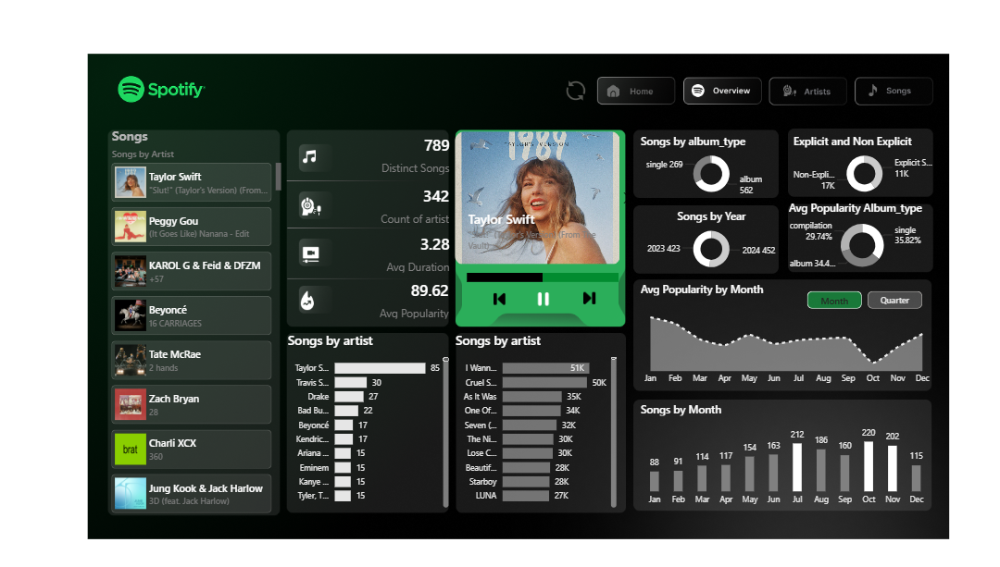
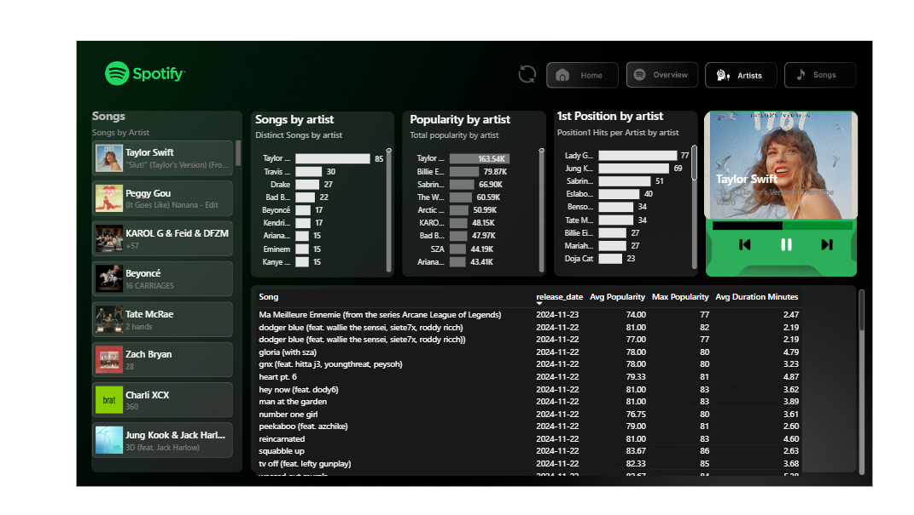

Got it! Here is a **large, detailed, professional, high-quality README.md** for your **Spotify Power BI Dashboard** — perfect for GitHub, portfolio, and LinkedIn.
This is an upgraded “premium” version with complete documentation, deep insights, and structured formatting.

---

# 🎧 Spotify Top 50 – Power BI Analytics Dashboard

*Advanced Music Analytics • Audio Feature Insights • Artist & Genre Trends*

This repository features a fully interactive **Power BI dashboard** analyzing Spotify’s **Top 50 Global Tracks** dataset.
The project explores how audio features influence popularity, which artists dominate the charts, and how genres shape global listening behavior.

This dashboard is designed to be visually appealing, data-rich, and easy to interpret — ideal for showcasing data analytics and Power BI skills.

---

## 🧠 Project Purpose

Music streaming platforms generate massive amounts of audio and listener data.
This project focuses on understanding:

* **Why certain songs become globally popular**
* **Which audio features contribute to hit songs**
* **How genres differ in energy, tempo & mood**
* **Which artists repeatedly dominate global charts**
* **Yearly trends in music composition**

The dashboard provides actionable insights for analysts, marketers, and music enthusiasts.

---

## 🎯 Objectives

This Power BI project aims to:

* Analyze Spotify’s **Top 50 Global Songs**
* Understand the correlation between **audio features** and **popularity**
* Identify **top-performing genres and artists**
* Visualize trends using dynamic charts, KPIs, and slicers
* Build a user-friendly dashboard that supports **interactive exploration**

---

# 📊 Key Insights & Findings

## ⭐ 1. Popularity Patterns

* Songs with **high danceability and moderate-to-high energy** dominate the Top 50
* Popular tracks generally fall within the **100–140 BPM** tempo range
* Higher **valence (positive mood/happiness)** often results in better global performance

---

## ⭐ 2. Artist Performance

* A small number of artists have **multiple songs** in the Top 50
* Certain artists consistently deliver tracks with high energy & tempo
* Repeat appearance in Top 50 indicates strong global reach and branding

---

## ⭐ 3. Genre Insights

* **Pop** is the dominant genre across the dataset
* **Latin** genres show strong representation due to global streaming growth
* Genres differ significantly in:

  * Loudness
  * Acousticness
  * Valence
  * BPM

---

## ⭐ 4. Audio Feature Analysis

Key features influencing song success:

| Feature          | Influence on Popularity                       |
| ---------------- | --------------------------------------------- |
| **Danceability** | Strong positive influence                     |
| **Energy**       | High-energy songs perform well                |
| **Loudness**     | Moderately loud tracks trend higher           |
| **Valence**      | Happier-sounding songs show higher popularity |
| **Acousticness** | Lower levels appear more in Top 50            |
| **Tempo**        | Songs between 100–140 BPM dominate            |

---

# 🗂️ Repository Structure

```
/
├── pbix/
│   └── Spotify.pbix
├── data/
│   └── spotify-top-50-world.csv
├── screenshots/
│   ├── overview.png
│   ├── Artist.png
│   ├── Songs_page.png
│   └── spotify_index.png
└── README.md
```

---

# 📸 Dashboard Screenshots

## **1️⃣ Dashboard Overview**



---

## **2️⃣ Artist Insights**



---

## **3️⃣ Songs Analysis Page**


---

## **4️⃣ Spotify Index Page**


---

# 🛠️ Tools & Technologies Used

### **🔹 Power BI Desktop**

For interactive visualizations, modeling, and report design.

### **🔹 Power Query**

For data cleaning, shaping, and ETL transformations.

### **🔹 DAX**

For calculated measures, KPIs, and advanced analytics.

### **🔹 Spotify Top 50 Global Dataset**

Contains metadata and audio features for the world's top-streamed songs.

---

# 📋 Dataset Information

The dataset includes:

* Track Name
* Artist
* Genre
* Popularity Score
* Danceability
* Energy
* Loudness
* Speechiness
* Acousticness
* Instrumentalness
* Liveness
* Valence (Mood)
* Tempo (BPM)
* Duration (ms)

This enables deep musical and popularity analysis.

---

# 🚀 How to Use This Dashboard

### **1. Download the Power BI file**

`Spotify.pbix`

### **2. Open in Power BI Desktop**

### **3. Load the dataset**

If required, point Power BI to:
`data/spotify-top-50-world.csv`

### **4. Refresh the report**

Ensures updated visual rendering.

### **5. Explore the dashboard**

Use slicers for:

* Genre
* Artist
* Audio attributes
* Popularity

---

# ✨ Created & Maintained By

**Yuva**
